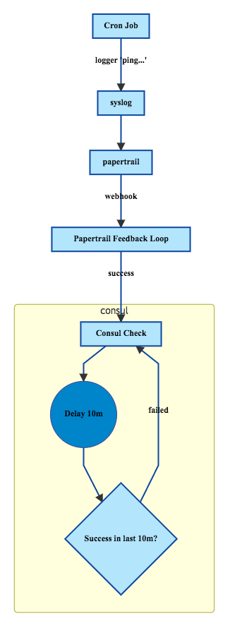

# Papertrail Feedback Loop

A tiny node process to to report logging success to consul.
Checks that all servers are logging to papertrail correctly.

## How it works

- on a cron interval send a message to papertrail from each server,
see [./bin/ping-papertrail](./bin/ping-papertrail).
- Papertrail then fires a webhook for the log message
- this node process receives the webhook.
- Updates a consul TTL check, see [./example/consul.json](./example/consul.json)

